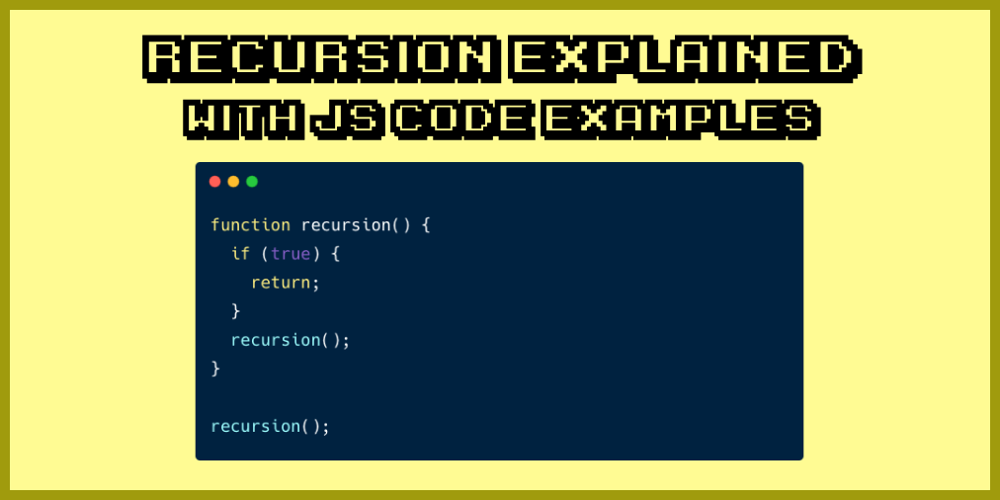
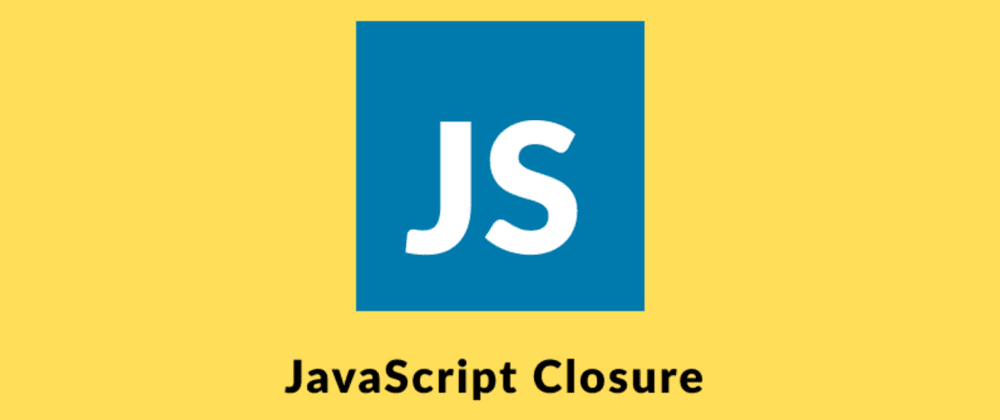
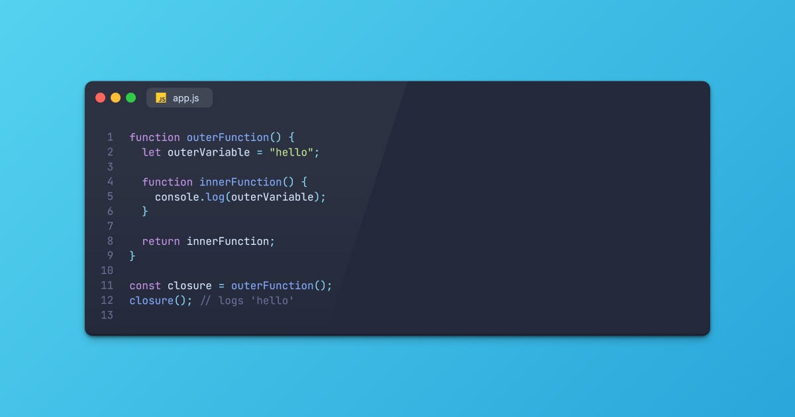

__________________
# ``What is Recurtion``
## Recurtion is when a function build itself and calls itself inside itself.Until the recurtion is given a contidion, it moves endlessy.
_______________________

## To prevent infinite recursion, you can use if...else statement (or similar approach) where one branch makes the recursive call, and the other doesn't

_________________
## ``Simple``

______________________

_______________________
# ``What is Clousure``
## A colusure is the combination of a function just we can create another function inside a function
____________
## ``Simple``

__________________
